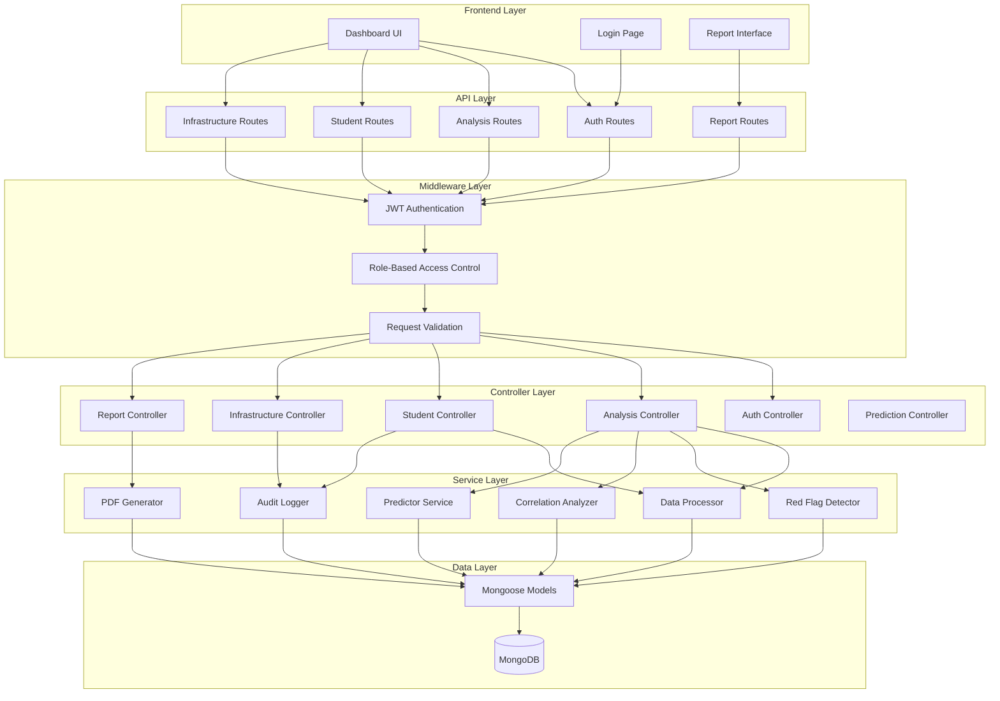

# Technical Design Document: Longitudinal Inspection System

## Overview

The Longitudinal Inspection System is a comprehensive educational analytics platform built on Node.js/Express/MongoDB that analyzes student performance data across multiple years (2015-2017), tracks infrastructure conditions, and generates predictive insights for educational planning.

### System Goals

- Provide longitudinal analysis of student performance across 3 years
- Automate detection of at-risk students through red flag analysis
- Correlate infrastructure improvements with academic performance
- Generate predictive models for future performance forecasting
- Deliver role-based access control for Admins and Inspectors
- Export comprehensive PDF reports for stakeholders

### Technology Stack

- **Backend**: Node.js with Express 5.2.1
- **Database**: MongoDB with Mongoose ODM 9.2.2
- **Authentication**: JWT (jsonwebtoken 9.0.3) with bcryptjs 3.0.3
- **PDF Generation**: PDFKit 0.17.2
- **Frontend**: Vanilla JavaScript with HTML/CSS
- **Security**: CORS-enabled API with role-based middleware

### Key Design Principles

- Separation of concerns: Controllers handle business logic, models define data structure
- Stateless authentication using JWT tokens
- Data validation at both model and controller layers
- Asynchronous processing for data-intensive operations
- RESTful API design for frontend-backend communication


## Architecture

### System Architecture Diagram



### Component Responsibilities

#### Frontend Layer
- **Dashboard UI**: Displays charts, metrics, and performance trends
- **Login Page**: Handles user authentication
- **Report Interface**: Allows report customization and download

#### API Layer
- **Auth Routes**: `/api/auth/login`, `/api/auth/register`
- **Analysis Routes**: `/api/analysis/trends`, `/api/analysis/red-flags`, `/api/analysis/correlations`
- **Student Routes**: `/api/students` (CRUD operations)
- **Infrastructure Routes**: `/api/infrastructure` (CRUD operations)
- **Report Routes**: `/api/reports/generate`, `/api/reports/download/:id`

#### Middleware Layer
- **JWT Authentication**: Validates tokens and extracts user information
- **RBAC**: Enforces role-based permissions (Admin vs Inspector)
- **Request Validation**: Validates incoming data against schemas

#### Controller Layer
- **Auth Controller**: Manages login, registration, session handling
- **Analysis Controller**: Orchestrates trend analysis, red flag detection
- **Student Controller**: Handles student data CRUD with validation
- **Infrastructure Controller**: Manages infrastructure records
- **Report Controller**: Coordinates PDF generation
- **Prediction Controller**: Manages predictive analytics

#### Service Layer
- **Data Processor**: Cleans, normalizes, and categorizes student data
- **Red Flag Detector**: Identifies students with significant performance drops
- **Correlation Analyzer**: Calculates infrastructure-performance correlations
- **Predictor Service**: Generates performance forecasts using linear regression
- **PDF Generator**: Creates formatted PDF reports
- **Audit Logger**: Records all data modifications


## Components and Interfaces

### Data Processor Service

**Purpose**: Clean, normalize, and categorize imported student data

**Interface**:
```javascript
class DataProcessor {
  /**
   * Normalizes student name to title case
   * @param {string} name - Raw student name
   * @returns {string} Normalized name
   */
  normalizeName(name)
  
  /**
   * Removes leading/trailing whitespace from all text fields
   * @param {Object} studentRecord - Raw student record
   * @returns {Object} Cleaned student record
   */
  cleanRecord(studentRecord)
  
  /**
   * Categorizes student by demographics
   * @param {Object} studentRecord - Student record
   * @returns {Object} Record with category fields added
   */
  categorizeStudent(studentRecord)
  
  /**
   * Validates and standardizes marks to 0-100 range
   * @param {Object} subjects - Subject marks object
   * @returns {Object} Validated marks
   * @throws {ValidationError} If marks are invalid
   */
  standardizeMarks(subjects)
  
  /**
   * Detects duplicate student IDs within a year
   * @param {string} studentId - Student ID to check
   * @param {number} year - Academic year
   * @returns {boolean} True if duplicate exists
   */
  async checkDuplicate(studentId, year)
  
  /**
   * Processes bulk student import
   * @param {Array} students - Array of student records
   * @param {number} year - Academic year
   * @returns {Object} Import results with success/error counts
   */
  async processBulkImport(students, year)
}
```

**Implementation Details**:
- Uses regex for name normalization: `name.trim().replace(/\w\S*/g, txt => txt.charAt(0).toUpperCase() + txt.substr(1).toLowerCase())`
- Age groups: 5-10 (Primary), 11-14 (Middle), 15-18 (Secondary), 19+ (Adult)
- Grade levels: 1-12
- Gender: Male/Female
- Marks validation: numeric, 0-100, max 2 decimal places

### Red Flag Detector Service

**Purpose**: Identify students with significant performance drops (≥15%)

**Interface**:
```javascript
class RedFlagDetector {
  /**
   * Detects students with significant drops between years
   * @param {number} yearFrom - Starting year (e.g., 2015)
   * @param {number} yearTo - Ending year (e.g., 2016)
   * @returns {Array} Array of flagged students with decline details
   */
  async detectSignificantDrops(yearFrom, yearTo)
  
  /**
   * Calculates percentage change in marks
   * @param {number} oldMark - Previous year mark
   * @param {number} newMark - Current year mark
   * @returns {number} Percentage change (negative for decline)
   */
  calculatePercentageChange(oldMark, newMark)
  
  /**
   * Identifies specific subjects showing decline
   * @param {Object} oldSubjects - Previous year subjects
   * @param {Object} newSubjects - Current year subjects
   * @returns {Array} Array of subject names with ≥15% drop
   */
  identifyDecliningSubjects(oldSubjects, newSubjects)
  
  /**
   * Gets all red-flagged students across all year transitions
   * @returns {Array} Comprehensive list of at-risk students
   */
  async getAllRedFlags()
}
```

**Algorithm**:
```javascript
// For each student with records in both years:
// 1. Match students by studentId across years
// 2. For each subject:
//    percentageChange = ((newMark - oldMark) / oldMark) * 100
// 3. If percentageChange <= -15%, flag the subject
// 4. If any subject is flagged, add student to red flag list
// 5. Calculate overall average decline
// 6. Return sorted by severity (largest decline first)
```

**Performance Target**: Complete analysis within 5 seconds for 1000+ students

### Correlation Analyzer Service

**Purpose**: Analyze relationships between infrastructure improvements and academic performance

**Interface**:
```javascript
class CorrelationAnalyzer {
  /**
   * Calculates Pearson correlation coefficient
   * @param {Array} x - First dataset (e.g., improvement dates)
   * @param {Array} y - Second dataset (e.g., mark changes)
   * @returns {number} Correlation coefficient (-1 to 1)
   */
  calculatePearsonCorrelation(x, y)
  
  /**
   * Identifies students affected by infrastructure improvement
   * @param {string} facilityId - Infrastructure facility ID
   * @param {number} year - Year of improvement
   * @returns {Array} Array of student IDs using that facility
   */
  async identifyAffectedStudents(facilityId, year)
  
  /**
   * Compares marks before and after improvement
   * @param {Array} studentIds - Students to analyze
   * @param {Date} improvementDate - Date of improvement
   * @returns {Object} Before/after comparison statistics
   */
  async compareBeforeAfter(studentIds, improvementDate)
  
  /**
   * Generates correlation report for specific improvement
   * @param {string} improvementId - Infrastructure improvement ID
   * @returns {Object} Correlation analysis with statistical significance
   */
  async analyzeImprovement(improvementId)
  
  /**
   * Calculates statistical significance (p-value)
   * @param {number} correlation - Correlation coefficient
   * @param {number} sampleSize - Number of data points
   * @returns {number} P-value
   */
  calculateSignificance(correlation, sampleSize)
}
```

**Algorithm**:
```javascript
// Pearson Correlation:
// r = Σ((x - x̄)(y - ȳ)) / √(Σ(x - x̄)² * Σ(y - ȳ)²)
// 
// Process:
// 1. Get improvement date and facility
// 2. Identify students using facility (by grade level, classroom assignment)
// 3. Get marks 1 year before improvement
// 4. Get marks 1 year after improvement
// 5. Calculate mark changes for each student
// 6. Calculate correlation between improvement timing and mark changes
// 7. Calculate p-value for significance (p < 0.05 = significant)
// 8. Return correlation coefficient, p-value, and interpretation
```

### Predictor Service

**Purpose**: Forecast future performance using historical trends

**Interface**:
```javascript
class Predictor {
  /**
   * Predicts future marks using linear regression
   * @param {string} subject - Subject to predict
   * @param {number} targetYear - Year to predict (e.g., 2018)
   * @returns {Object} Prediction with confidence interval
   */
  async predictSubjectPerformance(subject, targetYear)
  
  /**
   * Calculates linear regression parameters
   * @param {Array} years - Array of years [2015, 2016, 2017]
   * @param {Array} averages - Array of average marks
   * @returns {Object} {slope, intercept, r2}
   */
  calculateLinearRegression(years, averages)
  
  /**
   * Calculates confidence interval for prediction
   * @param {number} prediction - Predicted value
   * @param {Array} historicalData - Historical data points
   * @param {number} confidence - Confidence level (default 0.95)
   * @returns {Object} {lower, upper}
   */
  calculateConfidenceInterval(prediction, historicalData, confidence = 0.95)
  
  /**
   * Compares predictions against actual results
   * @param {number} year - Year to validate
   * @returns {Object} Accuracy metrics per subject
   */
  async validatePredictions(year)
  
  /**
   * Calculates prediction error percentage
   * @param {number} predicted - Predicted value
   * @param {number} actual - Actual value
   * @returns {number} Error percentage
   */
  calculateError(predicted, actual)
}
```

**Algorithm**:
```javascript
// Linear Regression: y = mx + b
// where y = predicted mark, x = year, m = slope, b = intercept
//
// Slope: m = (n*Σxy - Σx*Σy) / (n*Σx² - (Σx)²)
// Intercept: b = (Σy - m*Σx) / n
// R²: 1 - (SS_res / SS_tot)
//
// Confidence Interval (95%):
// CI = prediction ± (t_critical * standard_error)
// where standard_error = √(Σ(y - ŷ)² / (n-2))
```

### PDF Generator Service

**Purpose**: Create formatted PDF reports with charts and tables

**Interface**:
```javascript
class PDFGenerator {
  /**
   * Generates comprehensive performance report
   * @param {Object} options - Report configuration
   * @param {Array} options.years - Years to include
   * @param {Object} options.filters - Grade, gender, subject filters
   * @returns {Object} {pdfBuffer, downloadToken}
   */
  async generateReport(options)
  
  /**
   * Adds header with title and filters
   * @param {PDFDocument} doc - PDFKit document
   * @param {Object} options - Report options
   */
  addHeader(doc, options)
  
  /**
   * Adds performance trend section with charts
   * @param {PDFDocument} doc - PDFKit document
   * @param {Array} trendData - Trend analysis data
   */
  addTrendSection(doc, trendData)
  
  /**
   * Adds red flag students table
   * @param {PDFDocument} doc - PDFKit document
   * @param {Array} redFlags - Flagged students
   */
  addRedFlagSection(doc, redFlags)
  
  /**
   * Adds infrastructure correlation findings
   * @param {PDFDocument} doc - PDFKit document
   * @param {Array} correlations - Correlation analysis results
   */
  addCorrelationSection(doc, correlations)
  
  /**
   * Stores PDF and generates download token
   * @param {Buffer} pdfBuffer - Generated PDF
   * @returns {string} Download token (valid 24 hours)
   */
  async storePDF(pdfBuffer)
}
```

**Performance Target**: Generate PDF within 10 seconds for datasets up to 1000 students

### Audit Logger Service

**Purpose**: Track all data modifications for accountability

**Interface**:
```javascript
class AuditLogger {
  /**
   * Logs data modification event
   * @param {Object} event - Audit event details
   * @param {string} event.action - CREATE, UPDATE, DELETE
   * @param {string} event.entityType - Student, Infrastructure, etc.
   * @param {string} event.entityId - ID of modified entity
   * @param {string} event.userId - User who made change
   * @param {Object} event.changes - Before/after values
   */
  async logEvent(event)
  
  /**
   * Retrieves audit logs with filters
   * @param {Object} filters - Search criteria
   * @param {Date} filters.startDate - Start date
   * @param {Date} filters.endDate - End date
   * @param {string} filters.userId - Filter by user
   * @param {string} filters.action - Filter by action type
   * @returns {Array} Matching audit log entries
   */
  async getLogs(filters)
  
  /**
   * Middleware to automatically log modifications
   * @returns {Function} Express middleware
   */
  createMiddleware()
}
```


## Data Models

### Student Model (Enhanced)

```javascript
const studentSchema = new mongoose.Schema({
  // Identification
  studentId: { 
    type: String, 
    required: true,
    index: true
  },
  name: {
    type: String,
    required: true,
    trim: true
  },
  year: { 
    type: Number, 
    required: true,
    enum: [2015, 2016, 2017, 2018],
    index: true
  },
  
  // Demographics
  age: { 
    type: Number,
    min: 5,
    max: 25,
    required: true
  },
  ageGroup: {
    type: String,
    enum: ['Primary', 'Middle', 'Secondary', 'Adult']
  },
  gender: { 
    type: String, 
    enum: ['Male', 'Female'],
    required: true
  },
  gradeLevel: {
    type: Number,
    min: 1,
    max: 12,
    required: true
  },
  
  // Academic Performance
  subjects: {
    math: { 
      type: Number, 
      min: 0, 
      max: 100,
      validate: {
        validator: function(v) {
          return v === null || (v >= 0 && v <= 100 && /^\d+(\.\d{1,2})?$/.test(v.toString()));
        },
        message: 'Mark must be between 0-100 with max 2 decimal places'
      }
    },
    english: { type: Number, min: 0, max: 100 },
    science: { type: Number, min: 0, max: 100 },
    it: { type: Number, min: 0, max: 100 }
  },
  
  average: { 
    type: Number, 
    min: 0, 
    max: 100 
  },
  rank: Number,
  
  // Red Flag Tracking
  redFlags: [{
    year: Number,
    comparedToYear: Number,
    subjects: [String],
    overallDecline: Number,
    detectedAt: { type: Date, default: Date.now }
  }],
  
  // Metadata
  createdAt: { type: Date, default: Date.now },
  updatedAt: { type: Date, default: Date.now }
}, {
  timestamps: true
});

// Compound index for efficient year-based queries
studentSchema.index({ studentId: 1, year: 1 }, { unique: true });

// Pre-save middleware to calculate average and age group
studentSchema.pre('save', function(next) {
  // Calculate average
  const subjects = this.subjects;
  const marks = [subjects.math, subjects.english, subjects.science, subjects.it].filter(m => m != null);
  this.average = marks.length > 0 ? marks.reduce((a, b) => a + b, 0) / marks.length : 0;
  
  // Determine age group
  if (this.age >= 5 && this.age <= 10) this.ageGroup = 'Primary';
  else if (this.age >= 11 && this.age <= 14) this.ageGroup = 'Middle';
  else if (this.age >= 15 && this.age <= 18) this.ageGroup = 'Secondary';
  else this.ageGroup = 'Adult';
  
  next();
});
```

### Infrastructure Model (Enhanced)

```javascript
const infrastructureSchema = new mongoose.Schema({
  // Facility Information
  facilityId: {
    type: String,
    required: true,
    unique: true
  },
  facilityType: {
    type: String,
    enum: ['classroom', 'laboratory', 'library'],
    required: true
  },
  facilityName: {
    type: String,
    required: true
  },
  
  // Condition Tracking
  conditionHistory: [{
    year: {
      type: Number,
      required: true
    },
    rating: {
      type: Number,
      min: 1,
      max: 5,
      required: true
    },
    assessmentDate: {
      type: Date,
      required: true
    },
    notes: String,
    assessedBy: {
      type: mongoose.Schema.Types.ObjectId,
      ref: 'User'
    }
  }],
  
  // Improvement Tracking
  improvements: [{
    improvementId: {
      type: String,
      required: true
    },
    description: {
      type: String,
      required: true
    },
    improvementType: {
      type: String,
      enum: ['renovation', 'equipment_upgrade', 'new_construction', 'maintenance'],
      required: true
    },
    completionDate: {
      type: Date,
      required: true,
      validate: {
        validator: function(v) {
          return v <= new Date();
        },
        message: 'Completion date cannot be in the future'
      }
    },
    cost: Number,
    beforeRating: Number,
    afterRating: Number,
    recordedBy: {
      type: mongoose.Schema.Types.ObjectId,
      ref: 'User'
    }
  }],
  
  // Association with Students
  affectedGrades: [Number],
  capacity: Number,
  
  // Metadata
  createdAt: { type: Date, default: Date.now },
  updatedAt: { type: Date, default: Date.now }
}, {
  timestamps: true
});

// Index for efficient facility type queries
infrastructureSchema.index({ facilityType: 1 });
infrastructureSchema.index({ 'improvements.completionDate': 1 });
```

### User Model (Enhanced)

```javascript
const userSchema = new mongoose.Schema({
  username: {
    type: String,
    required: true,
    unique: true,
    trim: true,
    minlength: 3
  },
  password: {
    type: String,
    required: true,
    minlength: 6
  },
  role: { 
    type: String, 
    enum: ['Admin', 'Inspector'],
    required: true
  },
  
  // Session Management
  activeSessions: [{
    token: String,
    createdAt: Date,
    expiresAt: Date,
    ipAddress: String
  }],
  
  // Login Tracking
  lastLogin: Date,
  failedLoginAttempts: [{
    timestamp: Date,
    ipAddress: String
  }],
  
  // Metadata
  createdAt: { type: Date, default: Date.now },
  isActive: { type: Boolean, default: true }
}, {
  timestamps: true
});

// Remove password from JSON output
userSchema.methods.toJSON = function() {
  const obj = this.toObject();
  delete obj.password;
  delete obj.activeSessions;
  return obj;
};
```

### Audit Log Model (New)

```javascript
const auditLogSchema = new mongoose.Schema({
  // Event Information
  action: {
    type: String,
    enum: ['CREATE', 'UPDATE', 'DELETE', 'LOGIN', 'LOGOUT', 'LOGIN_FAILED'],
    required: true
  },
  entityType: {
    type: String,
    enum: ['Student', 'Infrastructure', 'User', 'Report'],
    required: true
  },
  entityId: {
    type: String,
    required: true
  },
  
  // User Information
  userId: {
    type: mongoose.Schema.Types.ObjectId,
    ref: 'User',
    required: true
  },
  username: String,
  userRole: String,
  
  // Change Details
  changes: {
    before: mongoose.Schema.Types.Mixed,
    after: mongoose.Schema.Types.Mixed
  },
  
  // Context
  ipAddress: String,
  userAgent: String,
  timestamp: {
    type: Date,
    default: Date.now,
    index: true
  }
}, {
  timestamps: false
});

// Compound index for efficient filtering
auditLogSchema.index({ userId: 1, timestamp: -1 });
auditLogSchema.index({ entityType: 1, entityId: 1 });
auditLogSchema.index({ action: 1, timestamp: -1 });

// TTL index to auto-delete logs older than 3 years
auditLogSchema.index({ timestamp: 1 }, { expireAfterSeconds: 94608000 }); // 3 years
```

### Prediction Model (New)

```javascript
const predictionSchema = new mongoose.Schema({
  // Prediction Metadata
  predictionId: {
    type: String,
    required: true,
    unique: true
  },
  targetYear: {
    type: Number,
    required: true
  },
  subject: {
    type: String,
    enum: ['math', 'english', 'science', 'it', 'overall'],
    required: true
  },
  
  // Prediction Data
  predictedValue: {
    type: Number,
    required: true
  },
  confidenceInterval: {
    lower: Number,
    upper: Number
  },
  
  // Model Parameters
  modelType: {
    type: String,
    default: 'linear_regression'
  },
  regressionParams: {
    slope: Number,
    intercept: Number,
    r2: Number
  },
  historicalData: [{
    year: Number,
    value: Number
  }],
  
  // Validation
  actualValue: Number,
  errorPercentage: Number,
  validatedAt: Date,
  
  // Metadata
  createdBy: {
    type: mongoose.Schema.Types.ObjectId,
    ref: 'User'
  },
  createdAt: {
    type: Date,
    default: Date.now
  }
});

predictionSchema.index({ targetYear: 1, subject: 1 });
```

### Report Model (New)

```javascript
const reportSchema = new mongoose.Schema({
  // Report Identification
  reportId: {
    type: String,
    required: true,
    unique: true
  },
  downloadToken: {
    type: String,
    required: true,
    unique: true
  },
  
  // Report Configuration
  reportType: {
    type: String,
    enum: ['performance_summary', 'red_flags', 'infrastructure_correlation', 'predictions'],
    default: 'performance_summary'
  },
  filters: {
    years: [Number],
    gradeLevel: Number,
    gender: String,
    subjects: [String]
  },
  
  // File Information
  fileName: String,
  fileSize: Number,
  filePath: String,
  
  // Access Control
  generatedBy: {
    type: mongoose.Schema.Types.ObjectId,
    ref: 'User',
    required: true
  },
  generatedAt: {
    type: Date,
    default: Date.now
  },
  expiresAt: {
    type: Date,
    required: true
  },
  downloadCount: {
    type: Number,
    default: 0
  },
  
  // Status
  status: {
    type: String,
    enum: ['generating', 'ready', 'expired', 'error'],
    default: 'generating'
  }
});

// TTL index to auto-delete expired reports
reportSchema.index({ expiresAt: 1 }, { expireAfterSeconds: 0 });
```


### API Endpoints

#### Authentication Endpoints

**POST /api/auth/register**
- **Access**: Admin only
- **Purpose**: Create new user account
- **Request Body**:
```json
{
  "username": "string",
  "password": "string",
  "role": "Admin | Inspector"
}
```
- **Response**: `{ "user": {...}, "message": "User created" }`
- **Validation**: Username min 3 chars, password min 6 chars

**POST /api/auth/login**
- **Access**: Public
- **Purpose**: Authenticate user and create session
- **Request Body**:
```json
{
  "username": "string",
  "password": "string"
}
```
- **Response**: 
```json
{
  "token": "jwt_token",
  "role": "Admin | Inspector",
  "expiresIn": "8h"
}
```
- **Side Effects**: 
  - Creates session token (8-hour expiration)
  - Logs successful login
  - Clears failed login attempts
  - Prevents concurrent sessions

**POST /api/auth/logout**
- **Access**: Authenticated users
- **Purpose**: Invalidate session token
- **Headers**: `Authorization: Bearer <token>`
- **Response**: `{ "message": "Logged out successfully" }`
- **Side Effects**: Removes token from active sessions


#### Student Data Endpoints

**POST /api/students/import**
- **Access**: Admin only
- **Purpose**: Bulk import student data for a specific year
- **Request Body**:
```json
{
  "year": 2015,
  "students": [
    {
      "studentId": "S001",
      "name": "john doe",
      "age": 15,
      "gender": "Male",
      "gradeLevel": 10,
      "subjects": {
        "math": 85.5,
        "english": 78,
        "science": 92,
        "it": 88
      }
    }
  ]
}
```
- **Response**: 
```json
{
  "imported": 45,
  "failed": 2,
  "duplicates": 1,
  "errors": [...]
}
```
- **Processing**: 
  - Normalizes names to title case
  - Trims whitespace
  - Validates marks (0-100, max 2 decimals)
  - Checks for duplicates
  - Calculates averages and age groups
  - Logs audit trail

**GET /api/students**
- **Access**: Admin, Inspector
- **Purpose**: Retrieve students with filtering
- **Query Parameters**:
  - `year`: Filter by year (2015-2017)
  - `gradeLevel`: Filter by grade
  - `gender`: Filter by gender
  - `ageGroup`: Filter by age group
  - `page`: Pagination (default 1)
  - `limit`: Results per page (default 50)
- **Response**: 
```json
{
  "students": [...],
  "total": 150,
  "page": 1,
  "pages": 3
}
```

**GET /api/students/:studentId/history**
- **Access**: Admin, Inspector
- **Purpose**: Get student's performance across all years
- **Response**:
```json
{
  "studentId": "S001",
  "name": "John Doe",
  "records": [
    {
      "year": 2015,
      "average": 85.5,
      "subjects": {...}
    },
    {
      "year": 2016,
      "average": 88.2,
      "subjects": {...}
    }
  ],
  "trend": "improving"
}
```

**PUT /api/students/:id**
- **Access**: Admin only
- **Purpose**: Update student record
- **Request Body**: Partial student object
- **Response**: Updated student
- **Side Effects**: Logs audit trail with before/after values

**DELETE /api/students/:id**
- **Access**: Admin only
- **Purpose**: Delete student record
- **Response**: `{ "message": "Student deleted" }`
- **Side Effects**: Logs deletion in audit trail


#### Analysis Endpoints

**GET /api/analysis/trends**
- **Access**: Admin, Inspector
- **Purpose**: Get performance trends across years
- **Query Parameters**:
  - `years`: Comma-separated years (default: 2015,2016,2017)
  - `subject`: Specific subject or 'overall'
  - `groupBy`: 'gender', 'gradeLevel', 'ageGroup'
- **Response**:
```json
{
  "trends": [
    {
      "year": 2015,
      "averageMark": 75.5,
      "passRate": 82.3,
      "subjectAverages": {
        "math": 78,
        "english": 73,
        "science": 76,
        "it": 75
      }
    }
  ],
  "classification": "improving",
  "overallChange": "+5.2%"
}
```
- **Performance**: Complete within 2 seconds

**GET /api/analysis/red-flags**
- **Access**: Admin, Inspector
- **Purpose**: Get students with significant performance drops
- **Query Parameters**:
  - `yearFrom`: Starting year (default: 2015)
  - `yearTo`: Ending year (default: 2016)
  - `threshold`: Drop percentage threshold (default: 15)
- **Response**:
```json
{
  "flaggedStudents": [
    {
      "studentId": "S001",
      "name": "John Doe",
      "yearFrom": 2015,
      "yearTo": 2016,
      "overallDecline": -18.5,
      "decliningSubjects": [
        {
          "subject": "math",
          "oldMark": 85,
          "newMark": 68,
          "percentageChange": -20
        }
      ]
    }
  ],
  "totalFlagged": 12,
  "detectedAt": "2024-01-15T10:30:00Z"
}
```
- **Performance**: Complete within 5 seconds for 1000+ students

**GET /api/analysis/correlations**
- **Access**: Admin, Inspector
- **Purpose**: Analyze infrastructure-performance correlations
- **Query Parameters**:
  - `improvementId`: Specific improvement to analyze
  - `facilityType`: Filter by facility type
- **Response**:
```json
{
  "correlations": [
    {
      "improvementId": "IMP001",
      "facilityName": "Science Lab A",
      "improvementType": "equipment_upgrade",
      "completionDate": "2016-03-15",
      "affectedStudents": 45,
      "beforeAverage": 72.5,
      "afterAverage": 78.3,
      "averageImprovement": 5.8,
      "correlationCoefficient": 0.67,
      "pValue": 0.023,
      "significance": "significant"
    }
  ]
}
```

**GET /api/analysis/predictions**
- **Access**: Admin, Inspector
- **Purpose**: Get performance predictions for future years
- **Query Parameters**:
  - `targetYear`: Year to predict (default: 2018)
  - `subject`: Specific subject or 'overall'
- **Response**:
```json
{
  "predictions": [
    {
      "subject": "math",
      "targetYear": 2018,
      "predictedValue": 79.5,
      "confidenceInterval": {
        "lower": 76.2,
        "upper": 82.8
      },
      "modelParams": {
        "slope": 1.8,
        "intercept": -3540.5,
        "r2": 0.89
      },
      "historicalData": [
        { "year": 2015, "value": 75.5 },
        { "year": 2016, "value": 77.2 },
        { "year": 2017, "value": 78.9 }
      ]
    }
  ]
}
```

**POST /api/analysis/predictions/validate**
- **Access**: Admin only
- **Purpose**: Validate predictions against actual data
- **Request Body**:
```json
{
  "year": 2018,
  "actualData": {
    "math": 80.2,
    "english": 76.5,
    "science": 79.8,
    "it": 77.3
  }
}
```
- **Response**:
```json
{
  "validations": [
    {
      "subject": "math",
      "predicted": 79.5,
      "actual": 80.2,
      "errorPercentage": 0.87,
      "accuracy": "high"
    }
  ]
}
```


#### Infrastructure Endpoints

**POST /api/infrastructure**
- **Access**: Admin, Inspector
- **Purpose**: Create new infrastructure facility record
- **Request Body**:
```json
{
  "facilityId": "LAB001",
  "facilityType": "laboratory",
  "facilityName": "Science Lab A",
  "affectedGrades": [9, 10, 11],
  "capacity": 30
}
```
- **Response**: Created facility object
- **Side Effects**: Logs creation in audit trail

**POST /api/infrastructure/:facilityId/assessment**
- **Access**: Admin, Inspector
- **Purpose**: Log infrastructure condition assessment
- **Request Body**:
```json
{
  "year": 2016,
  "rating": 4,
  "assessmentDate": "2016-01-15",
  "notes": "Good condition, minor wear on equipment"
}
```
- **Validation**: 
  - Rating must be 1-5
  - Assessment date cannot be in future
- **Response**: Updated facility with new assessment
- **Side Effects**: Logs assessment in audit trail

**POST /api/infrastructure/:facilityId/improvement**
- **Access**: Admin only
- **Purpose**: Record infrastructure improvement
- **Request Body**:
```json
{
  "improvementId": "IMP001",
  "description": "Upgraded all lab equipment",
  "improvementType": "equipment_upgrade",
  "completionDate": "2016-03-15",
  "cost": 15000,
  "beforeRating": 3,
  "afterRating": 5
}
```
- **Validation**:
  - Completion date cannot be in future
  - Improvement type must be valid enum
- **Response**: Updated facility with improvement record
- **Side Effects**: 
  - Logs improvement in audit trail
  - Triggers correlation analysis

**GET /api/infrastructure**
- **Access**: Admin, Inspector
- **Purpose**: Retrieve infrastructure facilities
- **Query Parameters**:
  - `facilityType`: Filter by type
  - `year`: Filter assessments by year
  - `minRating`: Filter by minimum rating
- **Response**: Array of facility objects with condition history

**GET /api/infrastructure/:facilityId/history**
- **Access**: Admin, Inspector
- **Purpose**: Get complete history of facility
- **Response**:
```json
{
  "facilityId": "LAB001",
  "facilityName": "Science Lab A",
  "conditionHistory": [...],
  "improvements": [...],
  "currentRating": 5,
  "totalInvestment": 25000
}
```

**PUT /api/infrastructure/:facilityId**
- **Access**: Admin only
- **Purpose**: Update facility information
- **Request Body**: Partial facility object
- **Response**: Updated facility
- **Side Effects**: Logs update in audit trail

**DELETE /api/infrastructure/:facilityId**
- **Access**: Admin only
- **Purpose**: Delete facility record
- **Response**: `{ "message": "Facility deleted" }`
- **Side Effects**: Logs deletion in audit trail


#### Report Endpoints

**POST /api/reports/generate**
- **Access**: Admin, Inspector
- **Purpose**: Generate PDF report
- **Request Body**:
```json
{
  "reportType": "performance_summary",
  "filters": {
    "years": [2015, 2016, 2017],
    "gradeLevel": 10,
    "gender": "Male",
    "subjects": ["math", "science"]
  }
}
```
- **Response**:
```json
{
  "reportId": "RPT_20240115_001",
  "downloadToken": "abc123xyz",
  "status": "generating",
  "estimatedTime": "8 seconds"
}
```
- **Processing**:
  - Validates filters
  - Fetches filtered data
  - Generates PDF with PDFKit
  - Stores file temporarily
  - Creates download token (24-hour expiration)
- **Performance**: Complete within 10 seconds for 1000 students

**GET /api/reports/:reportId/status**
- **Access**: Admin, Inspector
- **Purpose**: Check report generation status
- **Response**:
```json
{
  "reportId": "RPT_20240115_001",
  "status": "ready",
  "downloadUrl": "/api/reports/download/abc123xyz",
  "expiresAt": "2024-01-16T10:30:00Z",
  "fileSize": 245678
}
```

**GET /api/reports/download/:token**
- **Access**: Public (with valid token)
- **Purpose**: Download generated PDF report
- **Response**: PDF file stream
- **Headers**: 
  - `Content-Type: application/pdf`
  - `Content-Disposition: attachment; filename="report.pdf"`
- **Side Effects**: Increments download count
- **Validation**: Token must be valid and not expired

**GET /api/reports/history**
- **Access**: Admin, Inspector
- **Purpose**: Get user's report generation history
- **Query Parameters**:
  - `page`: Pagination
  - `limit`: Results per page
- **Response**:
```json
{
  "reports": [
    {
      "reportId": "RPT_20240115_001",
      "reportType": "performance_summary",
      "generatedAt": "2024-01-15T10:30:00Z",
      "status": "ready",
      "downloadCount": 3
    }
  ],
  "total": 15
}
```


#### Audit Endpoints

**GET /api/audit/logs**
- **Access**: Admin only
- **Purpose**: Retrieve audit logs with filtering
- **Query Parameters**:
  - `startDate`: Filter from date
  - `endDate`: Filter to date
  - `userId`: Filter by user
  - `action`: Filter by action type (CREATE, UPDATE, DELETE)
  - `entityType`: Filter by entity type
  - `page`: Pagination
  - `limit`: Results per page
- **Response**:
```json
{
  "logs": [
    {
      "action": "UPDATE",
      "entityType": "Student",
      "entityId": "S001",
      "userId": "60d5ec49f1b2c72b8c8e4f1a",
      "username": "admin1",
      "userRole": "Admin",
      "changes": {
        "before": { "average": 75 },
        "after": { "average": 78 }
      },
      "timestamp": "2024-01-15T10:30:00Z",
      "ipAddress": "192.168.1.100"
    }
  ],
  "total": 250,
  "page": 1,
  "pages": 5
}
```

**GET /api/audit/logs/export**
- **Access**: Admin only
- **Purpose**: Export audit logs as CSV
- **Query Parameters**: Same as GET /api/audit/logs
- **Response**: CSV file stream
- **Headers**: `Content-Type: text/csv`


## Correctness Properties

A property is a characteristic or behavior that should hold true across all valid executions of a system—essentially, a formal statement about what the system should do. Properties serve as the bridge between human-readable specifications and machine-verifiable correctness guarantees.

### Property 1: Year Dataset Isolation

*For any* student record imported into the system, querying by that record's year should return only students from that specific year, ensuring year datasets remain separate.

**Validates: Requirements 1.2**

### Property 2: Student-Year Association Invariant

*For any* student record in the system, the record must have exactly one academic year value from the set {2015, 2016, 2017, 2018}.

**Validates: Requirements 1.3, 1.1**

### Property 3: Cross-Year Referential Integrity

*For any* student ID that appears in multiple years, querying the student's history should return all records for that student ID sorted chronologically, maintaining referential integrity across years.

**Validates: Requirements 1.4**

### Property 4: Name Normalization

*For any* student name imported with arbitrary casing (uppercase, lowercase, mixed), the stored name should be in title case format (first letter of each word capitalized).

**Validates: Requirements 2.1**

### Property 5: Whitespace Trimming

*For any* student record with text fields containing leading or trailing whitespace, the stored record should have all whitespace removed from the beginning and end of each text field.

**Validates: Requirements 2.2**

### Property 6: Duplicate Detection Within Year

*For any* attempt to create two student records with the same student ID within the same year, the system should flag the duplicate and prevent the second insertion.

**Validates: Requirements 2.3, 17.1**

### Property 7: Mark Range Validation

*For any* mark value submitted to the system, if the value is outside the range [0, 100] or is not numeric, the system should reject the entry with an appropriate error message.

**Validates: Requirements 2.4, 16.1, 16.2, 16.3**

### Property 8: Mark Decimal Precision

*For any* mark value with more than two decimal places, the system should reject the entry or round to two decimal places.

**Validates: Requirements 16.4**

### Property 9: Automatic Categorization

*For any* student record with an age value, the system should automatically assign the correct age group: Primary (5-10), Middle (11-14), Secondary (15-18), or Adult (19+).

**Validates: Requirements 3.2**

### Property 10: Category-Based Filtering

*For any* filter applied by category (gender, age group, or grade level), the returned results should contain only students matching that category.

**Validates: Requirements 3.4**

### Property 11: Average Calculation Correctness

*For any* year and subject combination, the calculated average should equal the sum of all student marks in that subject for that year divided by the number of students.

**Validates: Requirements 4.1, 4.2**

### Property 12: Trend Classification Accuracy

*For any* performance trend calculated across years, if the average increases, it should be classified as "improving"; if it decreases, "declining"; if it remains within ±2%, "stable".

**Validates: Requirements 4.3**

### Property 13: Chronological Ordering

*For any* trend data returned by the system, the data points should be ordered by year in ascending order (2015, 2016, 2017).

**Validates: Requirements 4.4**

### Property 14: Pass Rate Calculation

*For any* year dataset, the pass rate should equal (number of students with average ≥ 50) / (total students) * 100.

**Validates: Requirements 5.1**

### Property 15: Year-Specific Data Retrieval

*For any* year selected by a user, the system should return only metrics and student records from that specific year.

**Validates: Requirements 5.3**

### Property 16: Dashboard Response Time

*For any* user interaction requesting trend data, the system should return results within 2 seconds.

**Validates: Requirements 5.4**

### Property 17: Significant Drop Detection

*For any* pair of consecutive years and any student with records in both years, if any subject mark decreases by 15% or more, the student should be flagged as at-risk.

**Validates: Requirements 6.1, 6.2**

### Property 18: Red Flag Subject Recording

*For any* student flagged as at-risk, the red flag record should include the specific subjects that showed a decline of 15% or more.

**Validates: Requirements 6.3**

### Property 19: Complete Red Flag Reporting

*For any* query for red-flagged students, all students meeting the significant drop criteria should be returned with their decline percentages.

**Validates: Requirements 6.4**

### Property 20: Red Flag Detection Performance

*For any* dataset of up to 1000 students, the red flag detection algorithm should complete within 5 seconds.

**Validates: Requirements 6.5**

### Property 21: Facility Type Validation

*For any* infrastructure record, the facility type must be one of {classroom, laboratory, library}, and any other value should be rejected.

**Validates: Requirements 7.1, 18.2**

### Property 22: Infrastructure Record Completeness

*For any* infrastructure assessment created, the record must include facility type, condition rating, and timestamp.

**Validates: Requirements 7.2**

### Property 23: Multiple Assessments Per Facility

*For any* facility, the system should allow multiple condition assessments to be recorded across different years without overwriting previous assessments.

**Validates: Requirements 7.3**

### Property 24: Infrastructure-Year Association

*For any* infrastructure assessment, the record must be associated with a specific academic year.

**Validates: Requirements 7.4**

### Property 25: Improvement Record Completeness

*For any* infrastructure improvement logged, the record must include a description and completion date.

**Validates: Requirements 8.1**

### Property 26: Improvement-Facility Linkage

*For any* infrastructure improvement, the improvement must be linked to a specific facility ID that exists in the system.

**Validates: Requirements 8.2**

### Property 27: Chronological Improvement History

*For any* facility with multiple improvements, querying the improvement history should return improvements sorted by completion date in chronological order.

**Validates: Requirements 8.3**

### Property 28: Improvement Type Categorization

*For any* infrastructure improvement, the improvement type must be one of {renovation, equipment_upgrade, new_construction, maintenance}.

**Validates: Requirements 8.4**

### Property 29: Affected Student Identification

*For any* infrastructure improvement, the correlation analyzer should identify students whose grade level matches the facility's affected grades.

**Validates: Requirements 9.1**

### Property 30: Before-After Mark Comparison

*For any* infrastructure improvement with a completion date, the correlation analyzer should retrieve student marks from the year before and the year after the improvement.

**Validates: Requirements 9.2**

### Property 31: Correlation Coefficient Calculation

*For any* set of before-after mark pairs, the calculated Pearson correlation coefficient should be between -1 and 1 inclusive.

**Validates: Requirements 9.3**

### Property 32: Statistical Significance Reporting

*For any* correlation analysis result, the result should include a p-value and significance indicator (significant if p < 0.05).

**Validates: Requirements 9.4**

### Property 33: Credential Verification

*For any* login attempt, if the username and password match a user record, access should be granted; otherwise, access should be denied.

**Validates: Requirements 10.1**

### Property 34: Admin Full Access

*For any* user with Admin role, all API endpoints including data modification endpoints should be accessible.

**Validates: Requirements 10.2**

### Property 35: Inspector Read-Only Access

*For any* user with Inspector role, data modification endpoints (POST, PUT, DELETE on students/infrastructure) should return 403 Forbidden.

**Validates: Requirements 10.3, 10.4**

### Property 36: Failed Login Logging

*For any* failed authentication attempt, an audit log entry should be created with timestamp, username, and IP address.

**Validates: Requirements 10.5**

### Property 37: Session Token Creation

*For any* successful authentication, a JWT token should be created with an expiration time of 8 hours from creation.

**Validates: Requirements 11.1**

### Property 38: Expired Token Rejection

*For any* API request with an expired token, the system should return 401 Unauthorized and require re-authentication.

**Validates: Requirements 11.2**

### Property 39: Logout Token Invalidation

*For any* logout request, the session token should be immediately removed from active sessions and subsequent requests with that token should be rejected.

**Validates: Requirements 11.3**

### Property 40: Single Session Enforcement

*For any* user account, when a new session is created, all previous active sessions for that user should be invalidated.

**Validates: Requirements 11.4**

### Property 41: Report Content Completeness

*For any* generated PDF report, the report should contain sections for 3-year performance summary, pass/fail rates, trend analysis, and flagged students.

**Validates: Requirements 12.1, 12.2**

### Property 42: Report Generation Performance

*For any* dataset of up to 1000 students, PDF report generation should complete within 10 seconds.

**Validates: Requirements 12.3**

### Property 43: Correlation in Reports

*For any* generated report, if infrastructure correlation data exists, it should be included in the PDF output.

**Validates: Requirements 12.4**

### Property 44: Download Link Expiration

*For any* generated report, the download link should be valid for 24 hours from generation time, after which it should return 404 or 410 Gone.

**Validates: Requirements 12.5**

### Property 45: Report Filtering

*For any* report generated with custom filters (years, grade level, gender, subject), the report should contain only data matching all applied filters.

**Validates: Requirements 13.1, 13.2, 13.3**

### Property 46: Filter Display in Report

*For any* report generated with custom filters, the report header should display all applied filters.

**Validates: Requirements 13.4**

### Property 47: Linear Regression Prediction

*For any* subject with historical data from 2015-2017, the predicted 2018 value should be calculated using the linear regression formula: y = mx + b, where m and b are derived from the historical data.

**Validates: Requirements 14.1, 14.2**

### Property 48: Confidence Interval Inclusion

*For any* prediction generated, the result should include both lower and upper bounds of the 95% confidence interval.

**Validates: Requirements 14.3**

### Property 49: Prediction vs Historical Data

*For any* prediction query, the response should include both predicted values and historical data points.

**Validates: Requirements 14.4**

### Property 50: Prediction Error Calculation

*For any* prediction with corresponding actual data, the error percentage should be calculated as: |predicted - actual| / actual * 100.

**Validates: Requirements 15.1, 15.2**

### Property 51: Prediction Accuracy Storage

*For any* prediction validation performed, the accuracy metrics (error percentage, actual vs predicted) should be stored in the database.

**Validates: Requirements 15.3**

### Property 52: Accuracy Display

*For any* subject with validated predictions, querying predictions should return accuracy metrics alongside the prediction data.

**Validates: Requirements 15.4**

### Property 53: Required Fields Validation

*For any* student record creation attempt, if any required field (name, studentId, year, gradeLevel) is missing, the system should reject the record and return an error listing the missing fields.

**Validates: Requirements 17.2, 17.3**

### Property 54: Age Range Validation

*For any* student record with an age value outside the range [5, 25], the system should reject the record with an appropriate error message.

**Validates: Requirements 17.4**

### Property 55: Condition Rating Validation

*For any* infrastructure assessment with a condition rating outside the range [1, 5], the system should reject the assessment with an appropriate error message.

**Validates: Requirements 18.1**

### Property 56: Validation Error Reporting

*For any* validation failure on student or infrastructure records, the system should return a specific error message describing what validation rule was violated.

**Validates: Requirements 18.3**

### Property 57: Future Date Rejection

*For any* infrastructure improvement with a completion date in the future, the system should reject the record with an error message.

**Validates: Requirements 18.4**

### Property 58: Audit Logging for Modifications

*For any* create, update, or delete operation on student or infrastructure records, an audit log entry should be created with action type, entity type, entity ID, user ID, and timestamp.

**Validates: Requirements 20.1, 20.2**

### Property 59: Audit Log Retention

*For any* audit log entry, the entry should remain in the database for at least 3 years from its creation timestamp.

**Validates: Requirements 20.3**

### Property 60: Audit Log Filtering

*For any* audit log query with filters (date range, user ID, action type), the returned results should contain only log entries matching all applied filters.

**Validates: Requirements 20.4**


## Error Handling

### Error Categories

#### Validation Errors (400 Bad Request)
- Invalid mark values (outside 0-100 range, non-numeric, too many decimals)
- Missing required fields (name, studentId, year, gradeLevel)
- Invalid age values (outside 5-25 range)
- Invalid condition ratings (outside 1-5 range)
- Invalid facility types (not in enum)
- Future completion dates for improvements
- Duplicate student IDs within same year

**Response Format**:
```json
{
  "error": "Validation Error",
  "message": "Invalid data provided",
  "details": [
    {
      "field": "subjects.math",
      "value": 105,
      "constraint": "Must be between 0 and 100"
    }
  ]
}
```

#### Authentication Errors (401 Unauthorized)
- Missing authentication token
- Invalid token format
- Expired token
- Token from logged-out session

**Response Format**:
```json
{
  "error": "Authentication Error",
  "message": "Invalid or expired token",
  "code": "TOKEN_EXPIRED"
}
```

#### Authorization Errors (403 Forbidden)
- Inspector attempting data modification
- User accessing resources outside their role permissions

**Response Format**:
```json
{
  "error": "Authorization Error",
  "message": "Insufficient permissions for this operation",
  "requiredRole": "Admin"
}
```

#### Not Found Errors (404 Not Found)
- Student ID not found
- Facility ID not found
- Report not found or expired
- User not found

**Response Format**:
```json
{
  "error": "Not Found",
  "message": "Student with ID 'S001' not found in year 2016",
  "entityType": "Student",
  "entityId": "S001"
}
```

#### Conflict Errors (409 Conflict)
- Duplicate student ID within same year
- Concurrent session attempt
- Duplicate facility ID

**Response Format**:
```json
{
  "error": "Conflict",
  "message": "Student with ID 'S001' already exists in year 2016",
  "conflictingEntity": {
    "studentId": "S001",
    "year": 2016
  }
}
```

#### Performance Errors (408 Request Timeout)
- Red flag detection exceeds 5 seconds
- Report generation exceeds 10 seconds
- Dashboard query exceeds 2 seconds

**Response Format**:
```json
{
  "error": "Timeout",
  "message": "Operation exceeded maximum allowed time",
  "maxTime": "5 seconds",
  "operation": "red_flag_detection"
}
```

#### Server Errors (500 Internal Server Error)
- Database connection failures
- Unexpected calculation errors
- PDF generation failures
- Correlation analysis errors

**Response Format**:
```json
{
  "error": "Internal Server Error",
  "message": "An unexpected error occurred",
  "errorId": "ERR_20240115_001",
  "timestamp": "2024-01-15T10:30:00Z"
}
```

### Error Handling Strategy

#### Controller Level
```javascript
// Wrap all async operations in try-catch
try {
  const result = await service.performOperation(data);
  res.json(result);
} catch (error) {
  if (error instanceof ValidationError) {
    return res.status(400).json({
      error: 'Validation Error',
      message: error.message,
      details: error.details
    });
  }
  // Log error for debugging
  logger.error('Unexpected error', { error, userId: req.user.id });
  res.status(500).json({
    error: 'Internal Server Error',
    message: 'An unexpected error occurred',
    errorId: generateErrorId()
  });
}
```

#### Service Level
```javascript
// Throw specific error types
class ValidationError extends Error {
  constructor(message, details) {
    super(message);
    this.name = 'ValidationError';
    this.details = details;
  }
}

// Use in services
if (mark < 0 || mark > 100) {
  throw new ValidationError('Invalid mark value', [
    { field: 'mark', value: mark, constraint: 'Must be between 0 and 100' }
  ]);
}
```

#### Middleware Level
```javascript
// Global error handler
app.use((error, req, res, next) => {
  // Log all errors
  auditLogger.logError({
    error: error.message,
    stack: error.stack,
    userId: req.user?.id,
    path: req.path,
    method: req.method
  });
  
  // Send appropriate response
  if (error.name === 'ValidationError') {
    return res.status(400).json({ /* validation error response */ });
  }
  // ... handle other error types
});
```

#### Database Level
```javascript
// Handle MongoDB errors
try {
  await Student.create(studentData);
} catch (error) {
  if (error.code === 11000) {
    // Duplicate key error
    throw new ConflictError('Student ID already exists in this year');
  }
  throw error;
}
```

### Graceful Degradation

#### Partial Import Success
- When bulk importing students, continue processing even if some records fail
- Return summary with success count, failure count, and error details
- Allow admin to review and fix failed records

#### Correlation Analysis Fallback
- If insufficient data for correlation analysis, return message indicating minimum data requirements
- If correlation calculation fails, log error but don't fail entire request

#### Report Generation Fallback
- If specific chart generation fails, include text summary instead
- If report exceeds time limit, queue for background processing and notify user

#### Prediction Fallback
- If insufficient historical data (< 2 years), return message indicating minimum requirements
- If regression calculation fails, return historical averages as baseline


## Testing Strategy

### Dual Testing Approach

The system will employ both unit testing and property-based testing to ensure comprehensive coverage:

- **Unit tests**: Verify specific examples, edge cases, and error conditions
- **Property tests**: Verify universal properties across all inputs using randomized data

Both testing approaches are complementary and necessary. Unit tests catch concrete bugs in specific scenarios, while property tests verify general correctness across a wide range of inputs.

### Property-Based Testing

#### Framework Selection

**For Node.js/JavaScript**: Use **fast-check** library (https://github.com/dubzzz/fast-check)

```bash
npm install --save-dev fast-check
```

#### Configuration

- **Minimum iterations**: 100 runs per property test (due to randomization)
- **Seed management**: Use deterministic seeds for reproducible failures
- **Shrinking**: Enable automatic shrinking to find minimal failing cases

#### Property Test Structure

Each property test must:
1. Reference its corresponding design document property
2. Use the tag format: `Feature: longitudinal-inspection-system, Property {number}: {property_text}`
3. Run minimum 100 iterations
4. Test with randomly generated data

**Example Property Test**:
```javascript
const fc = require('fast-check');

describe('Feature: longitudinal-inspection-system, Property 4: Name Normalization', () => {
  it('should normalize any student name to title case', () => {
    fc.assert(
      fc.property(
        fc.string({ minLength: 1, maxLength: 50 }), // Random name
        (name) => {
          const normalized = dataProcessor.normalizeName(name);
          
          // Check title case: first letter of each word capitalized
          const words = normalized.split(' ');
          for (const word of words) {
            if (word.length > 0) {
              expect(word[0]).toBe(word[0].toUpperCase());
              if (word.length > 1) {
                expect(word.slice(1)).toBe(word.slice(1).toLowerCase());
              }
            }
          }
        }
      ),
      { numRuns: 100 }
    );
  });
});
```

#### Property Test Coverage

Each of the 60 correctness properties should have a corresponding property-based test:

- **Properties 1-10**: Data processing and validation
- **Properties 11-20**: Performance analysis and red flags
- **Properties 21-32**: Infrastructure tracking and correlation
- **Properties 33-40**: Authentication and authorization
- **Properties 41-52**: Reporting and predictions
- **Properties 53-60**: Validation and audit logging

### Unit Testing

#### Framework Selection

**For Node.js/JavaScript**: Use **Jest** testing framework

```bash
npm install --save-dev jest supertest
```

#### Unit Test Focus Areas

Unit tests should focus on:

1. **Specific Examples**: Concrete test cases with known inputs/outputs
2. **Edge Cases**: Boundary conditions, empty datasets, single records
3. **Error Conditions**: Invalid inputs, missing data, constraint violations
4. **Integration Points**: API endpoints, database operations, middleware

#### Unit Test Structure

**Example Unit Tests**:
```javascript
describe('Student Import Controller', () => {
  describe('POST /api/students/import', () => {
    it('should import valid student data', async () => {
      const response = await request(app)
        .post('/api/students/import')
        .set('Authorization', `Bearer ${adminToken}`)
        .send({
          year: 2015,
          students: [
            {
              studentId: 'S001',
              name: 'John Doe',
              age: 15,
              gender: 'Male',
              gradeLevel: 10,
              subjects: { math: 85, english: 78, science: 92, it: 88 }
            }
          ]
        });
      
      expect(response.status).toBe(200);
      expect(response.body.imported).toBe(1);
      expect(response.body.failed).toBe(0);
    });
    
    it('should reject marks over 100', async () => {
      const response = await request(app)
        .post('/api/students/import')
        .set('Authorization', `Bearer ${adminToken}`)
        .send({
          year: 2015,
          students: [
            {
              studentId: 'S002',
              name: 'Jane Doe',
              age: 16,
              gender: 'Female',
              gradeLevel: 10,
              subjects: { math: 105, english: 78, science: 92, it: 88 }
            }
          ]
        });
      
      expect(response.status).toBe(400);
      expect(response.body.error).toBe('Validation Error');
    });
    
    it('should handle empty dataset', async () => {
      const response = await request(app)
        .post('/api/students/import')
        .set('Authorization', `Bearer ${adminToken}`)
        .send({
          year: 2015,
          students: []
        });
      
      expect(response.status).toBe(200);
      expect(response.body.imported).toBe(0);
    });
  });
});
```

### Test Organization

```
tests/
├── unit/
│   ├── controllers/
│   │   ├── authController.test.js
│   │   ├── studentController.test.js
│   │   ├── infrastructureController.test.js
│   │   └── reportController.test.js
│   ├── services/
│   │   ├── dataProcessor.test.js
│   │   ├── redFlagDetector.test.js
│   │   ├── correlationAnalyzer.test.js
│   │   ├── predictor.test.js
│   │   └── pdfGenerator.test.js
│   └── middleware/
│       ├── authMiddleware.test.js
│       └── validation.test.js
├── property/
│   ├── dataProcessing.property.test.js
│   ├── analysis.property.test.js
│   ├── infrastructure.property.test.js
│   ├── authentication.property.test.js
│   ├── reporting.property.test.js
│   └── validation.property.test.js
└── integration/
    ├── studentWorkflow.test.js
    ├── infrastructureWorkflow.test.js
    └── reportGeneration.test.js
```

### Test Data Management

#### Fixtures
- Create reusable test data fixtures for common scenarios
- Use factory functions to generate test data with variations

```javascript
// testFixtures.js
const createStudent = (overrides = {}) => ({
  studentId: 'S001',
  name: 'John Doe',
  age: 15,
  gender: 'Male',
  gradeLevel: 10,
  year: 2015,
  subjects: { math: 85, english: 78, science: 92, it: 88 },
  ...overrides
});
```

#### Database Seeding
- Use separate test database
- Clear database before each test suite
- Seed with known data for integration tests

```javascript
beforeEach(async () => {
  await Student.deleteMany({});
  await Infrastructure.deleteMany({});
  await User.deleteMany({});
  
  // Seed test admin user
  await User.create({
    username: 'testadmin',
    password: await bcrypt.hash('password', 10),
    role: 'Admin'
  });
});
```

### Performance Testing

#### Performance Benchmarks
- Red flag detection: < 5 seconds for 1000 students
- Dashboard queries: < 2 seconds
- Report generation: < 10 seconds for 1000 students

**Example Performance Test**:
```javascript
describe('Performance Requirements', () => {
  it('should detect red flags within 5 seconds for 1000 students', async () => {
    // Seed 1000 students
    await seedStudents(1000);
    
    const startTime = Date.now();
    await redFlagDetector.detectSignificantDrops(2015, 2016);
    const duration = Date.now() - startTime;
    
    expect(duration).toBeLessThan(5000);
  });
});
```

### Coverage Goals

- **Unit Test Coverage**: Minimum 80% code coverage
- **Property Test Coverage**: 100% of correctness properties (60 properties)
- **Integration Test Coverage**: All critical user workflows
- **API Endpoint Coverage**: 100% of endpoints

### Continuous Integration

```yaml
# .github/workflows/test.yml
name: Test Suite
on: [push, pull_request]
jobs:
  test:
    runs-on: ubuntu-latest
    steps:
      - uses: actions/checkout@v2
      - uses: actions/setup-node@v2
        with:
          node-version: '18'
      - run: npm install
      - run: npm run test:unit
      - run: npm run test:property
      - run: npm run test:integration
      - run: npm run test:coverage
```

### Test Commands

```json
{
  "scripts": {
    "test": "jest",
    "test:unit": "jest tests/unit",
    "test:property": "jest tests/property",
    "test:integration": "jest tests/integration",
    "test:coverage": "jest --coverage",
    "test:watch": "jest --watch"
  }
}
```

